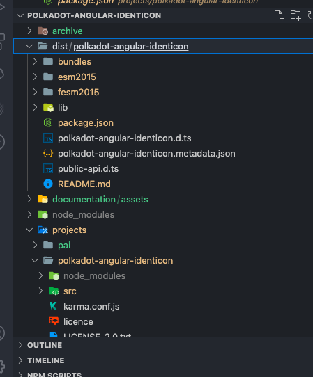

# Polkadot Angular Identicon building guide 🏗

This guide show how the `polkadot-angular-identicon` is built for release.

## Building

1) Install the Angular cli with `npm i -g @angular/cli`

2) Clone the project `polkadot-angular-identicon` and open it into your favorite IDE.

4) Open the project with your IDE's

3) Install the project's dependencies with `npm i`
You can find also under projects the `polkadot-angular-identicon` project wich is the identicon component project

4) From another terminal cd into `projects/polkadot-andular-identicon` and type `npm i` as well to install the component identicon project's the dependencies

At this point we can build the `polkadot-andular-identicon` component. We need to go back to the root **polkadot-angular-identicon** project in the terminal 

Run `ng build polkadot-angular-identicon --prod` to build the project. The build artifacts will be stored in the `dist/` directory under the folder with the name `polkadot-angular-identicon`

At this point we have generated files that we can be pulished to npm.

## Unit Testing

If you want to test the library, after cloning the `polkadtot-angular-identicon`.

Open the project from your IDE.

1) Open the IDE's terminal and type `npm i` to install the `polkadtot-angular-identicon` root project dependencies 
2) open another terminal from the IDE and install the dependencies of the library itself under `projects` folder by `cd project/polkadot-angular-identicon` and type `npm i`

At this step all the dependencies are installed.

Run `ng test` to execute the unit tests via [Karma](https://karma-runner.github.io) wich comes with angular.

*The business logic of this library is contained in the `render-helper.ts` file so unit tests of the business logic for this library is `render-helper.spec.ts`.*

*Note that this `polkadot-web-identicon` is based on the `polkadot-angular-identicon` component so they share the same business logic in the `render-helper.ts` then the same unit tests.*

**Note**

This `polkadot-web-identicon` project is based on this project

## Good to know ⚠️

Angular is a typescript based framework.

It is worth mentionning that typescript doesn't support `.mjs` files extension and the [polkadot.js ui shared](https://github.com/polkadot-js/ui/tree/master/packages/ui-shared) library tool ships with mjs files extensions.

See [Typescript and mjs files](https://github.com/microsoft/TypeScript/issues/27957)

Also `ng-packagr` the library used to build angular libraries also doesn't yet support .mjs files extension

see 

[Angular and mjs link 1](https://github.com/angular/angular-cli/issues/16552)
[Angular and mjs link 2](https://github.com/angular/angular-cli/issues/16581)

It is for those reason we need to do some modifications in order to use the component in Angular applications.