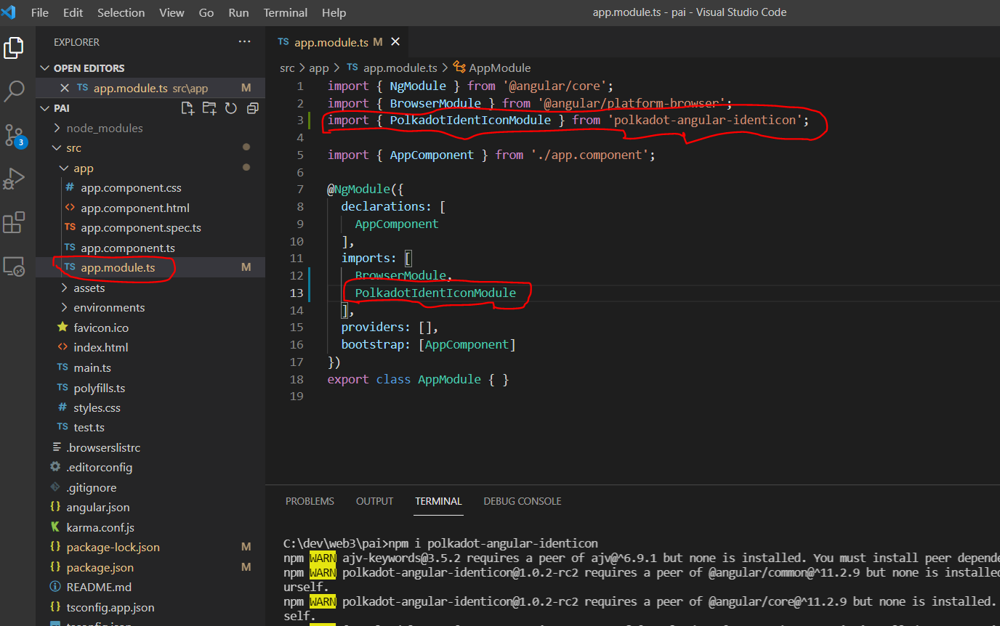

# Polkadot Angular IdentIcon

A generic identity icon that can render icons in Angular applications for Substrate based chains

Project for the polkadot angular based identicons, serves also the web components.

## Usage Guide 🍽 

We assume that you have the `angular cli` installed if not then inslall it by typing

`npm install -g @angular/cli`.

After the cli installation is done just type `ng --version` and it will display the Angular cli version
For more info please visit this [link](https://angular.io/cli).

## Create an Angular project

To create an angular project type: `ng new my-project` and the `my-project` will be created.

In our case let's create a project called `pai` (like polkadot-angular-identicon 😎)

`ng new pai` and you will see something like this 


## install `polkadot-angular-identicon` npm dependency

Open the `pai` project we just created via your favorite IDE and from IDE's terminal and install the component
 `npm i polkadot-angular-identicon`.

 

After the package is installed open the `app.module.ts` file in the project under `src`  and add the `PolkadotIdentIconModule` into the `imports` section (this is the section were we import an angular module).

See capture below.



***The `PolkadotIdentIconModule` can be also used in any other  angular feature module in the `imports` or `exports` section***.

## Usage of the component

Now what we only have to do is to use the identicon in the template component of our linkings for instance in our `pai` project we created, let's use it in the `app.component.html` file under `src/app` folder.

Open the `app.component.html`file and remove it's content and past this line:

```html

<h3>Polkadot icon theme  with default size</h3>
<polkadot-angular-identicon address="5FHneW46xGXgs5mUiveU4sbTyGBzmstUspZC92UhjJM694ty" theme="polkadot"></polkadot-angular-identicon>
<br>

<h3>beachball icon theme  with size of 80 </h3>
<polkadot-angular-identicon address="5FHneW46xGXgs5mUiveU4sbTyGBzmstUspZC92UhjJM694ty" theme="beachball" [size]="80"></polkadot-angular-identicon>
<br>

<h3>jdenticon icon theme  with size of 120</h3>
<polkadot-angular-identicon  address="5FHneW46xGXgs5mUiveU4sbTyGBzmstUspZC92UhjJM694ty" theme="jdenticon" [size]="120"></polkadot-angular-identicon>
```

### additional configurations
*⚠️The `polkadot-angular-identicon` is based on the [polkadot ui shared](https://github.com/polkadot-js/ui/tree/master/packages/ui-shared) that has some dependencies that ships with some files with `.mjs` extension.
Snce typescript doesn't support `.mjs` we need to do the below to properly display icons⚠️*


Open the `package.json` file and add at the following at the end before the closing bracket:

```json
"browser": {
    "crypto": false
}
```

open the `tsconfig.app.json` and add `"node"` to the `types` property under `compilerOptions` section

```json
{
 ...
  "compilerOptions": {
     ...
    "types": ["node"]
  },
...
 }
```

open `tsconfig.json`, at the end of the `compilerOptions` add the following

```json
    "paths": {
      "crypto": ["./node_modules/crypto-browserify"],
      "stream": ["./node_modules/stream-browserify"]
      }
```

And one last thing open the `polyfills.ts` file under `src` and add the snippet below the end

```javascript
(window as any).global = window;
(window as any).Buffer = (window as any).Buffer || require('buffer').Buffer;
```
At this step we are done for the configurations.

## Run the app
To test the app run the command `ng serve` and open your browser at `localhost:4200`

You can also type the command `ng serve -o` and it will automatically open the app in your default browser.

## Unit tests
Clone the `polkadot-angular-identicon` library project from your IDE if not already done.

1) Open the IDE's terminal and type `npm i` to install the  root project dependencies 
2) open another terminal from the IDE to install the dependencies of the library itself which is under `projects` folder by navigating `cd project/polkadot-angular-identicon` and type `npm i`

At this step all the dependencies are installed for :

- `polkadot-angular-identicon`

- `polkadot-angular-identicon/project/polkadot-angular-identicon`.

To run the test make sure we are under `polkadot-angular-identicon/project/polkadot-angular-identicon` and type
 `ng test` command to run the unit tests (`Karma` test runner  and `jasmine` a javascript test framework installed by tdefault when creating the project).

A browser automatically opened under `http://localhost:9876/?id=xxxxx` and the results of the tests executed are displayed.


on the terminal side we can see


We might need to stop the test runner server on the terminal.

*The business logic of this library is contained in the `render-helper.ts` file so unit tests of the business logic for this library is `render-helper.spec.ts`.*

*Also note that the `polkadot-web-identicon` is depends on the `polkadot-angular-identicon` component so they share the same business logic in the `render-helper.ts` then the same unit tests.*

## Hackers Guide

For those who wants to build or tweak the library see [BUILD.md](BUILD.md) file to know how we build and deployed it for use.


Improvements are on the way.
Happy coding 😎!!!
